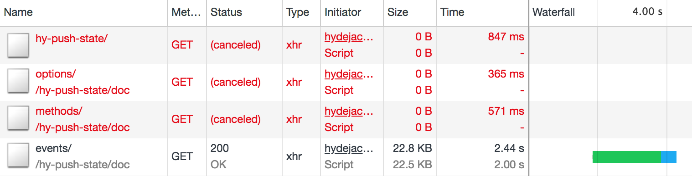

# hy-push-state

[](https://badge.fury.io/js/hy-push-state)

**hy-push-state** is a web component that lets you turn web pages into web apps. The component dynamically loads new content (formerly known as "ajax") and inserts it into the current page, without causing Flash of White, Flash of Unstyled Content, etc.

> Turn static web sites into dynamic web apps.
{:.lead}

**hy-push-state** is similar to [pjax] and [smoothState], but offers a [more advanced pre-fetching logic][pref] and gives you more control over its internals to enable [advanced page transition animations][anim].

**hy-push-state** is already used by hundreds of sites as part of the [Hydejack]{:.external} Jekyll theme.

**NOTE**: The current version is still a pre-release. The public API may still change in important ways.
{:.message}

[pref]: #page-prefetching
[anim]: #advanced-animations

[pjax]: https://github.com/defunkt/jquery-pjax
[smoothstate]: https://github.com/miguel-perez/smoothState.js
[rxjs]: https://github.com/ReactiveX/rxjs
[hydejack]: https://hydejack.com/

<!--more-->

## Examples
When viewing this page on [webcomponents.org][wcorg], the example below will render as an interactive demo. Otherwise, find the standalone examples below.

[wcorg]: https://www.webcomponents.org/element/qwtel/hy-push-state


<!--
```
<custom-element-demo>
  <template>
    <script src="https://unpkg.com/@webcomponents/webcomponentsjs@1.1.0"></script>
    <link rel="import" href="https://unpkg.com/hy-push-state/dist/webcomponent/hy-push-state.html">
    <next-code-block></next-code-block>
  </template>
</custom-element-demo>
```
-->
```html
<hy-push-state initial-href="https://qwtel.com/hy-push-state/example/simple/" prefetch>
  <p>
    <a href="./1.html">Page 1</a>
    <a href="./2.html">Page 2</a>
    <a href="./3.html">Page 3</a>
  </p>
  <p>Super simple example.</p>
</hy-push-state>
```

When viewing this document on GitHub, npm, or elsewhere, you can check out the standalone examples:

* [WebComponent Example](https://qwtel.com/hy-push-state/example/webcomponent/){:.external}
* [jQuery Example](https://qwtel.com/hy-push-state/example/jquery/){:.external}
* [Vanilla JS Example](https://qwtel.com/hy-push-state/example/vanilla/){:.external}
* [Mixin Example](https://qwtel.com/hy-push-state/example/mixin/){:.external}


## License
**hy-push-state** is Open Source but not free.

You may use the component in accordance with the [GPL-3.0 license](licenses/GPL-3.0.md),
but this means you must be willing to release your code under a GPLv3-compatible license in turn.

For cases were this is not acceptable the following commercial licenses available:

|              | Personal           | Startup            | Enterprise         |
|:-------------|:------------------:|:------------------:|:------------------:|
| # Developers | 2                  | 15                 | ∞                  |
| License      | [Personal][pl]     | [Startup][sl]      | [Enterprise][el]   |
| Price        | $29                | $249               | $499               |
| | [**Buy**][bp]{:.gumroad-button} | [**Buy**][bs]{:.gumroad-button} | [**Buy**][be]{:.gumroad-button} |
{:.stretch-table}


[pl]: licenses/personal.md
[sl]: licenses/startup.md
[el]: licenses/enterprise.md
[bp]: https://gumroad.com/l/hy-push-state-personal
[bs]: https://gumroad.com/l/hy-push-state-startup
[be]: https://gumroad.com/l/hy-push-state-enterprise


## Usage

**hy-push-state** can be used in a variety of ways:
* As [Web Component](usage/#web-component), both as *ES6 Module* and *HTML Import*
* As [jQuery](usage/#jquery) plugin
* As [Vanilla](usage/#vanilla) JavaScript class
* As part of [bundled frontend code](usage/#bundlers).
* (Advanced) Possibly as part of your own component hierarchy as [ES6 Mixin][esmixins].

[esmixins]: http://justinfagnani.com/2015/12/21/real-mixins-with-javascript-classes/

### Web Component
The Web Component is the preferred way of using **hy-push-state**, but requires [support] in the browser or a [polyfill]. There are multiple ways of including it on your page:

#### Bundled ES6 Module
This is the version that is going to have native support across all major browsers the soonest.

~~~html
<script type="module" href="https://unpkg.com/hy-push-state/dist/webcomponent/module"></script>

<hy-push-state replace-ids="main,aside" prefetch>
  <main id="main"><!-- ... --></main>
  <aside id="aside"><!-- ... --></aside>
</hy-push-state>
~~~

#### HTML Import
Some browsers have decided against implementing HTML Imports, but they are easily polyfilled.

~~~html
<link rel="import" href="https://unpkg.com/hy-push-state/dist/webcomponent/hy-push-state.html">

<hy-push-state replace-ids="main,aside" prefetch>
  <main id="main"><!-- ... --></main>
  <aside id="aside"><!-- ... --></aside>
</hy-push-state>
~~~

#### Unbundled ES6 Module (experimental)
When loading the component form the [unpkg] CDN, you can import the source directly by appending the `?module` query parameter.

~~~html
<script type="module" src="https://unpkg.com/hy-push-state/src/webcomponent/module?module"></script>

<hy-push-state replace-ids="main,aside" prefetch>
  <main id="main"><!-- ... --></main>
  <aside id="aside"><!-- ... --></aside>
</hy-push-state>
~~~

Note that this approach will result in hundreds of separate HTTP requests (one for each module) and is intended for testing and prototypes only. Importing unbundled ES6 modules is much slower than bundled distributions and will remain so for the foreseeable future.

One advantage of this approach is that shared dependencies will not be included twice when using more than one component from the Hydejack component family. However, setting up webpack is a better solution in these cases:

#### Bundlers
You can use **hy-push-state** with a frontend bundler like webpack or rollup.
Just install the component with npm or yarn and import the source in your code:

```js
import 'hy-push-state/src/webcomponent/module';
```

If you want to have control over when the custom element gets `define`d, you can also import the `HTMLElement` like so:

```js
import { HyPushStateElement } from 'hy-push-state/src/webcomponent';
// ...
customElements.define('hy-push-state', HyPushStateElement);
```

Note that all of **hy-push-state**'s dependencies are valid ES6 modules, so that they can be inlined with webpack's [`ModuleConcatenationPlugin`][mcp].

[support]: https://caniuse.com/#feat=template,custom-elementsv1,shadowdomv1,es6-module,imports
[polyfill]: https://github.com/webcomponents/webcomponentsjs
[unpkg]: https://unpkg.com/
[mcp]: https://webpack.js.org/plugins/module-concatenation-plugin/


## Documentation

* [Options](doc/options.md)
* [Methods](doc/methods.md)
* [Events](doc/events.md)

### Page Prefetching
**hy-push-state** starts a HTTP request as soon as the user "hints" that he/she is about to open a new page by hovering, focusing, or touching (`touchstart`-ing) a link. If the guess is correct, the request has a 100ms or more head-start, further increasing the perceived speed of your site in addition to the already fast webapp-style page replacing.

Unlike other implementations of this feature, the current prefetch request will be canceled if the user hints at a different link, ensuring that there will be no more than one prefetch request in flight at a time. This avoids clogging up the network with requests that are going to be discarded upon arrival, which is essential when on slow 3G connections.

For example, hovering links in the sidebar on [qwtel.com](https://qwtel.com/hy-push-state/) will produce a timeline like the one below:

{:.lead}
Chrome developer console screenshot of prefetching requests.
{:.figure}

### Advanced Animations
**hy-push-state** allows building advanced page transition animations, like the ones used in [Hydejack](https://qwtel.com/hydejack/variations/) and state-of-the-art web apps. These can be promise-based instead of time-based to account for smaller delays caused by other code, GC interruptions, or slower devices in general

The code for a simple fade-out animation using the [Web Animations API][waapi] may look like:

```js
pushStateEl.addEventListener('hy-push-state-start', ({ detail }) =>
  detail.transitionUntil(new Promise(res =>
    document
      .getElementById('my-content')
      .animate([{ opacity: 1 }, { opacity: 0 }], { duration: 250 })
      .addEventListener('finish', res)
  ))
);
```

Time-based animations are possible as well and are configured with the [`duration` option](doc/options.md#duration).

[waapi]: https://developer.mozilla.org/en-US/docs/Web/API/Web_Animations_API/Using_the_Web_Animations_API

### Gold Standard
This component follows the Web Components [Gold Standard](doc/gold-standard.md).

### Source
The source code is written in a *literal programming* style, and should be reasonably approachable.
However, some knowledge of [RxJS] is required.

The core functionality is implemented in [`mixin / index.js`](doc/source/mixin/README.md),
which is used to create the framework-specific versions of the component.

* `jquery`
  * [`index.js`](doc/source/jquery/README.md)
* `mixin`
  * [`constants.js`](doc/source/mixin/constants.md)
  * [`event-listeners.js`](doc/source/mixin/event-listeners.md)
  * [`events.js`](doc/source/mixin/events.md)
  * [`fetching.js`](doc/source/mixin/fetching.md)
  * [`history.js`](doc/source/mixin/history.md)
  * [`index.js`](doc/source/mixin/README.md)
  * [`methods.js`](doc/source/mixin/methods.md)
  * [`operators.js`](doc/source/mixin/operators.md)
  * [`script-hack.js`](doc/source/mixin/script-hack.md)
  * [`scrolling.js`](doc/source/mixin/scrolling.md)
  * [`setup.js`](doc/source/mixin/setup.md)
  * [`update.js`](doc/source/mixin/update.md)
* `vanilla`
  * [`index.js`](doc/source/vanilla/README.md)
* `webcomponent`
  * [`html-import.s`](doc/source/webcomponent/html-import.md)
  * [`index.js`](doc/source/webcomponent/README.md)
  * [`module.js`](doc/source/webcomponent/module.md)
* [`common.js`](doc/source/common.md)
* [`index.js`](doc/source/README.md)
* [`url.js`](doc/source/url.md)

### Size
The size of the minified bundle is around 90kb, or ~20kb gzipped.
The majority of it comes from RxJS. When already using RxJS in your project, or using more than one component of the Hydejack component family, consider using a [frontend bundler](usage/README.md#bundlers).

| Size | File |
|-----:|:-----|
|  84K | `dist/jquery/index.js` |
|  19K | `dist/jquery/index.js.gz` |
|  80K | `dist/mixin/index.js` |
|  18K | `dist/mixin/index.js.gz` |
|  81K | `dist/vanilla/index.js` |
|  18K | `dist/vanilla/index.js.gz` |
|  86K | `dist/webcomponent/html-import.js` |
|  19K | `dist/webcomponent/html-import.js.gz` |
|  86K | `dist/webcomponent/index.js` |
|  19K | `dist/webcomponent/index.js.gz` |
|  86K | `dist/webcomponent/module.js` |
|  19K | `dist/webcomponent/module.js.gz` |


[rxjs]: https://github.com/ReactiveX/rxjs
